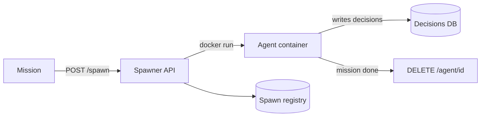

<div align="center">

# ⚡ Flashpoint

### Spin up thousands of ephemeral AI agents in seconds — each with a unique, traceable identity.

[](LICENSE)
[](spawner/spawner.py)
[](agent/Dockerfile)
[](terraform/)

Flashpoint is an agent spawner: one HTTP call creates a containerised AI task
agent with its own mission, model, gateway and identity; another destroys it.
Agents report decisions to a persistent store, so work survives teardown.

</div>

---

## Why it exists

The goal is to run **massive parallel tasks** by spinning up huge numbers of
short-lived agents, each given different instructions, then tearing them down.
Measured on a single runner: **spawn ~1.3 s, gateway ready ~7 s, destroy ~1.9 s**.
The spawner is stateless, so you shard horizontally and the wall-clock to spawn
a wave stays roughly flat as the fleet grows. See [`docs/scaling.md`](docs/scaling.md)
for the full 1 → 100,000,000 agent compute/cost model.

## Quick start

```bash
# 1. Build the agent image on a Docker host
docker build -t flashpoint/agent:latest agent/

# 2. Configure + start the spawner
cp spawner/.env.example /opt/flashpoint/.env   # fill in values
sudo cp spawner/as-spawner.service /etc/systemd/system/
sudo systemctl enable --now as-spawner

# 3. Spawn an agent
curl -X POST http://localhost:2880/spawn \
  -H "Content-Type: application/json" \
  -d '{"mission":"analyse Q1 receipts","tier":"ephemeral"}'
```

Response includes the agent's `agent_id`, `gateway_url` and `gateway_token`.
Destroy it with `DELETE /agent/<id>`. Spawn a whole wave with
[`examples/spawn_wave.py`](examples/spawn_wave.py).

## How it works



Each agent is a plain Docker container of a pre-built image — no provisioning,
so spawn is a single `docker run`. Decisions are written out-of-band, so
teardown is a clean `docker stop && docker rm` with nothing to reconcile.

## Identity & traceability

Every agent gets a unique id (`fp-<hex>` or your own, e.g. `wave-7-agent-00001`)
that ties together its spawn record, live container label, gateway, and
decision-log rows. An optional spawn registry persists the id→spawn mapping
after teardown, so any agent can be traced back to its exact spawn. Details in
[`docs/identity.md`](docs/identity.md).

## Repository layout

| Path | What |
|---|---|
| `spawner/spawner.py` | The Spawner API (spawn / list / lookup / destroy) |
| `spawner/.env.example` | Configuration template |
| `spawner/as-spawner.service` | systemd unit |
| `agent/` | Agent Dockerfile + bootstrap (`entrypoint.sh`, decision logger, SOUL) |
| `terraform/` | Optional LXC-clone path for full-OS agents |
| `examples/spawn_wave.py` | Parallel wave spawn/destroy example |
| `docs/` | Architecture, identity, scaling, research sources |

## Docs

| Doc | Contents |
|---|---|
| [`docs/architecture.md`](docs/architecture.md) | Components, flow, tiers, why it is fast |
| [`docs/identity.md`](docs/identity.md) | agent_id, spawn records, registry, traceability chain |
| [`docs/scaling.md`](docs/scaling.md) | Compute + spawn-rate + LLM cost from 1 to 100 M agents |
| [`docs/references.md`](docs/references.md) | Sources and assumptions behind the numbers |

## Security

The spawner ships with **no API authentication** and agents run as root — fine
on a trusted internal network only. Before exposing it or running untrusted
missions, add API auth, non-root agents and spawner-reach rules. See
[`docs/architecture.md`](docs/architecture.md#security-note). Never commit
credentials: configuration is via `.env` (gitignored), and `.env.example` holds
placeholders only.

## Requirements

- A Docker host for the spawner and agents
- Python 3.9+ (stdlib only — no pip deps for the spawner)
- Optional: Postgres + pgvector for the decision log
- Optional: Proxmox + Terraform for the LXC path

## License

MIT — see [LICENSE](LICENSE).
