<p align="center">
  
</p>

<p align="center">
  
  
  
  
  
</p>

<p align="center">
  <strong>Spin up thousands of ephemeral AI agents in seconds — each with a unique, traceable identity.</strong><br/>
  One HTTP call creates a containerised agent with its own mission, model and gateway ·
  another destroys it · decisions persist after teardown.
</p>

<p align="center">
  🤖 <strong>Deploy it hands-off:</strong> hand your agent the ready-made
  <a href="docs/agent-deploy-prompt.md"><strong>deployment prompt</strong></a>
  and it installs, builds, configures, runs and smoke-tests Flashpoint for you.
</p>

---

## Why this exists

Some tasks are too large for one agent and too parallel for a queue of one.
Reading ten thousand documents, scoring a hundred thousand records, probing a
million endpoints — these are *embarrassingly parallel* problems, and the right
shape for them is not a bigger agent but a **swarm of small, disposable ones**.

Flashpoint is the spawner for that swarm. You give each agent its own mission —
or let an agent generate the variants for you — and Flashpoint ignites them in
parallel, gives every one a name you can trace, and burns them away cleanly when
the work is done. Measured on a single runner: **spawn ~1.3 s · gateway ready
~7 s · destroy ~1.9 s**. Because the spawner is stateless, you shard it across
runners and the wall-clock to ignite a wave stays roughly flat as the fleet
grows. The full 1 → 100,000,000-agent compute and cost model is in
[`docs/scaling.md`](docs/scaling.md), and concrete patterns (estate audits,
document processing, parallel research, mass repo changes, simulation,
durable waves) are in [`docs/use-cases.md`](docs/use-cases.md).

## Architecture

<p align="center">
  
</p>

| Layer | Role | Lifetime |
|---|---|---|
| **Orchestrator** | Issues missions (a human, another agent, or the intake CLI) | long-lived |
| **Spawner API** | Creates / lists / looks up / destroys agents on a Docker host | long-lived, stateless |
| **Agents** | Ephemeral containers, one per mission | seconds–hours |
| **Decisions DB** | Postgres + pgvector; every decision keyed by `agent_id` | permanent |
| **Spawn registry** | JSONL (single-host) or Postgres (fleet-wide) id→spawn map | permanent |

Spawn is one `docker run`; teardown is `docker stop && docker rm`. There is no
state to reconcile because decisions are written out-of-band — that is what
makes the lifecycle fast.

## Identity & traceability

<p align="center">
  
</p>

Every agent carries one id (`fp-<hex>`, or your own such as
`wave-7-agent-00001`) that ties together its **spawn record**, its **live
container label**, its **gateway credentials**, and its **decision-log rows**.
Ask the spawner for any id — before or after the container is gone — and get
back the exact spawn that produced it:

```
GET /agent/wave-7-agent-00001
```

Full chain, collision analysis and fleet-wide Postgres resolution in
[`docs/identity.md`](docs/identity.md).

## Quick start

```bash
# On a fresh Docker host (as root), from the repo root:
./deploy/runner.sh --gateway-host <this-host-ip>
```

One command builds the agent image, writes `/opt/flashpoint/.env`, installs and
starts the spawner, and health-checks it. Then ignite an agent:

```bash
curl -X POST http://localhost:2880/spawn \
  -H "Content-Type: application/json" \
  -d '{"mission":"analyse Q1 receipts","tier":"ephemeral"}'
```

> **Deploy hands-off with an agent.** Hand your agentic system (Hermes, OpenClaw,
> or any agent runtime) the ready-made, fully-detailed deployment prompt in
> [`docs/agent-deploy-prompt.md`](docs/agent-deploy-prompt.md) and it will
> install, build, configure, run and smoke-test Flashpoint on a target host with
> no human involvement beyond supplying SSH access and two secrets.

<details><summary><b>Manual setup</b> instead of deploy/runner.sh</summary>

```bash
docker build -t flashpoint/agent:latest agent/
cp spawner/.env.example /opt/flashpoint/.env   # fill in values
sudo cp spawner/as-spawner.service /etc/systemd/system/
sudo systemctl enable --now as-spawner
```

</details>

## Pushing missions en masse

Missions reach the swarm three ways — all via the batch endpoint:

```bash
# a manifest (JSON/JSONL/CSV)
python3 intake/flashpoint_intake.py --spawners http://10.0.0.5:2880 \
  --manifest intake/missions.example.json --batch wave-1

# a database query (missions already in Postgres)
python3 intake/flashpoint_intake.py --spawners http://10.0.0.5:2880 \
  --from-db "host=db dbname=missions user=ro password=..." \
  --query "SELECT mission_text FROM missions WHERE wave = 7" --batch wave-7

# or let an agent generate the variants from one base mission
python3 intake/flashpoint_intake.py --spawners http://10.0.0.5:2880 \
  --generate "analyse a quarterly financial report" --variants 25 --batch q1
```

The intake shards missions across every spawner you list and calls each one's
`POST /spawn_batch`. Inspect or destroy a whole wave by batch:
`GET /batch/<id>` · `DELETE /batch/<id>`. Details in
[`docs/intake.md`](docs/intake.md).

## Durable waves with Temporal

For production-scale waves, run the Temporal layer
([`flashpoint_temporal/`](flashpoint_temporal/)). Temporal is the orchestration
brain — durability, idempotency, rate-limiting, real-time visibility — and the
spawner is the ignition muscle. Why Temporal and not Airflow: Flashpoint is an
event-driven, sub-second, spawn-and-destroy system, not a scheduled batch
pipeline; Airflow's DAG scheduler chokes on hundreds of thousands of dynamic
short tasks, while Temporal is built for exactly this.

```bash
pip install -r flashpoint_temporal/requirements.txt
python3 -m flashpoint_temporal.worker          # long-lived worker
python3 -m flashpoint_temporal.start_wave \
  --manifest intake/missions.example.json --wave wave-1 --max-concurrent 32
```

You get durable waves (a crashed worker replays to the exact failed agent),
idempotent spawns keyed on `agent_id` (retries never double-spawn), guaranteed
teardown in a `finally`, and a live per-agent dashboard in the Temporal UI. See
[`flashpoint_temporal/README.md`](flashpoint_temporal/README.md).

## Repository layout

| Path | What |
|---|---|
| `spawner/spawner.py` | Spawner API — spawn, spawn_batch, list, lookup, destroy (agent + batch) |
| `spawner/.env.example` | Configuration template (never committed with real values) |
| `spawner/as-spawner.service` | systemd unit |
| `flashpoint_temporal/` | Temporal worker + `AgentWaveWorkflow` for durable waves |
| `deploy/runner.sh` | One-command runner setup |
| `deploy/schema.sql` | Postgres fleet-wide spawn-registry schema |
| `agent/` | Agent Dockerfile + bootstrap (`entrypoint.sh`, decision logger, SOUL) |
| `intake/` | Mission-intake CLI + example manifest/CSV |
| `invention/` | Invention pipeline (generate → screen → research gate → backtest) + seeds |
| `terraform/` | Optional LXC-clone path for full-OS agents |
| `examples/` | Parallel wave spawn/destroy example |
| `docs/` | Architecture, identity, intake, scaling, references |

## Docs

| Doc | Contents |
|---|---|
| [`docs/architecture.md`](docs/architecture.md) | Components, flow, tiers, why it is fast |
| [`docs/use-cases.md`](docs/use-cases.md) | Worked examples: audits, documents, research, repos, simulation, waves |
| [`docs/invention.md`](docs/invention.md) | Invention pipeline: frog-leap ideation + sourced adversarial backtesting |
| [`docs/identity.md`](docs/identity.md) | agent_id, spawn records, registry, traceability |
| [`docs/intake.md`](docs/intake.md) | Manifest / database / agent-generated mission intake |
| [`docs/agent-deploy-prompt.md`](docs/agent-deploy-prompt.md) | Hands-off deployment prompt for agentic systems |
| [`docs/scaling.md`](docs/scaling.md) | Compute + spawn-rate + LLM cost, 1 → 100 M agents |
| [`docs/references.md`](docs/references.md) | Sources and assumptions behind the numbers |
| [`flashpoint_temporal/README.md`](flashpoint_temporal/README.md) | Durable waves on Temporal |

## Security

The spawner ships with **no API authentication** and agents run as root — fine
on a trusted internal network only. Before exposing it or running untrusted
missions, add API auth, non-root agents and spawner-reach rules (see
[`docs/architecture.md`](docs/architecture.md#security-note)). Configuration is
via `.env` (gitignored); only `.env.example` placeholders are committed. Never
commit credentials.

## Requirements

- A Docker host for the spawner and agents
- Python 3.9+ (stdlib only for the spawner; `psycopg2` only if you use the
  Postgres registry or DB intake)
- Optional: Postgres + pgvector for the decision log and fleet-wide registry
- Optional: Proxmox + Terraform for the LXC path

## License

MIT — see [LICENSE](LICENSE).

<p align="center">
  <sub>Built for the mass-parallel era — ignite, instruct, trace, burn.</sub>
</p>
